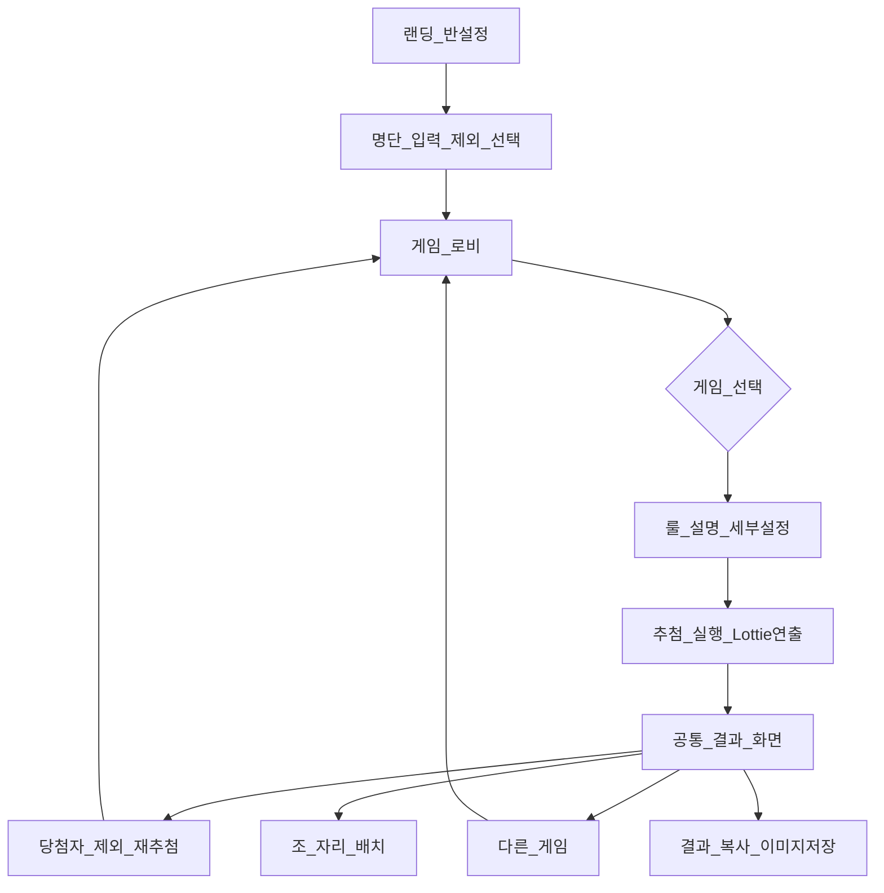
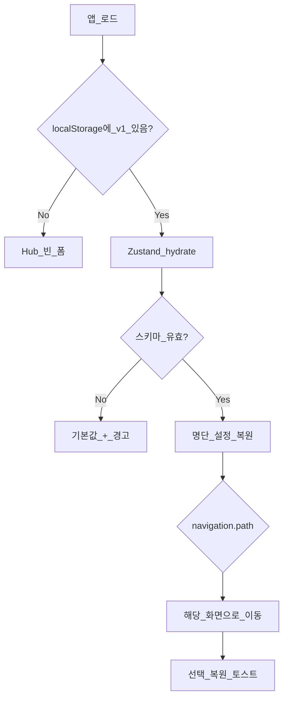

# PRD: 픽미업! (Pick Me Up!)

> **문서 버전:** 0.3  
> **작성일:** 2026-07-07  
> **상태:** Draft  
> **참고:** [신답룰렛](https://shindap-rullet.vercel.app/) · [Text-to-Lottie](https://github.com/diffusionstudio/lottie)

---

## 1. 개요

### 1.1 한 줄 정의

초등학교 교실에서 선생님이 **전자칠판/빔 프로젝터**로 띄워 쓰는 **통합 추첨 포털**. 반 명단을 한 번 입력하면 레이스·제비뽑기·사다리타기·돌림판·슬롯/가챠 등 여러 뽑기 게임을 골라 실행하고, 공통 결과 화면으로 조 배치·자리 배치까지 처리한다.

### 1.2 문제 정의

| Pain Point | 현재 | 목표 |
|---|---|---|
| 매번 이름 재입력 | 게임마다 별도 앱·도구 | 명단 1회 입력, 전 게임 공유 |
| 상황별 도구 부재 | "빠른 1명" vs "순위" vs "조 짜기" 도구가 다름 | 상황 필터 + 게임 갤러리 |
| 결과 활용 불편 | 복사·저장·재추첨 UX 제각각 | 통일된 결과 화면 |
| **새로고침 시 입력 소실** | F5·탭 닫기·오조작 시 명단·설정 초기화 | **브라우저 로컬 자동 저장·복원** |
| 연출 품질 | CSS/Canvas만으로 한계 | **Lottie 기반 고품질 모션** |

### 1.3 제품 비전

> *"이름 한 번, 뽑기는 마음대로."*

교실에서 가장 자주 쓰는 추첨 시나리오를 **하나의 포털**에 모으고, 아이들이 눈을 뗄 수 없는 **재미있지만 공정한** 연출을 제공한다.

---

## 2. 목표 및 성공 지표

### 2.1 비즈니스/제품 목표

- MVP 출시 후 **교실 현장에서 바로 쓸 수 있는** 완성도
- 5종 게임 + 공통 포털 UX로 **신답룰렛 단일 앱을 대체·확장**
- Lottie 애니메이션으로 **차별화된 시각 경험** (경량 JSON, 벡터 스케일)

### 2.2 성공 지표 (MVP)

| 지표 | 목표 |
|---|---|
| 반 설정 → 게임 시작 | 3클릭 이내 |
| 1명 뽑기 (제비/돌림판) | 설정 후 10초 이내 결과 |
| 전자칠판 가독성 | 3m 거리에서 이름·버튼 식별 |
| **새로고침 후 복원** | 명단·설정·마지막 화면 100% 복원, 재입력 0회 |
| **자동 저장 지연** | 입력 후 500ms 이내 localStorage 반영 |
| Lottie 로드 | 첫 프레임 1초 이내 (로컬 JSON) |

### 2.3 비목표 (Out of Scope — MVP)

- 회원가입·**클라우드** 동기화 (→ 로컬 저장은 **In Scope**)
- 학생/학부모 앱
- 실시간 멀티 디바이스 연동
- 레이스 **맵 편집기** (Phase 3 이후 검토)

---

## 3. 타겟 사용자

### 3.1 Primary Persona: 초등 담임 선생님

- **상황:** 수업 중 전자칠판 앞, 20~30명 학급
- **Needs:** 빠른 발표 순서, 1명 당첨, 조·자리 배치, 분위기 전환
- **Constraints:** 수업 시간 짧음, 소리 on/off 필요, 조작 단순

### 3.2 Secondary Persona: 전담 교사 / 특수활동

- 행사·체육·미술 등 **역할 나누기**, **팀 구성**
- 사다리타기·돌림판 위주

---

## 4. 사용자 여정



### 4.1 핵심 시나리오

| # | 시나리오 | 추천 게임 | 기대 결과 |
|---|---|---|---|
| S1 | 오늘 발표자 1명 | 제비뽑기 / 돌림판 | 30초 내 1명 |
| S2 | 전원 발표 순서 | 제비뽑기 (순차) | 순위 리스트 |
| S3 | 청소/역할 2~4갈래 | 사다리타기 | 이름-역할 매핑 |
| S4 | 1등·꼴찌·전체 순위 | 레이스 | 순위 + 조/자리 |
| S5 | 학기말·분위기 UP | 슬롯/가챠 | 1명 + 재미 연출 |

---

## 5. 기능 요구사항

### 5.1 공통 — 반 설정 (Hub)

| ID | 요구사항 | 우선순위 |
|---|---|---|
| H-01 | 반 이름 입력 (결과·이미지에 표시) | P0 |
| H-02 | 학생 명단: 한 줄 1명 | P0 |
| H-03 | 가중치: `이름*3` → pool에 3회 등록 | P0 |
| H-04 | 이번 추첨 제외 (체크박스) | P0 |
| H-05 | 명단 **자동 저장** (수동 저장 버튼 불필요) | P0 |
| H-06 | 텍스트 붙여넣기 / 전체 지우기 | P1 |
| H-07 | 반 프로필 여러 개 저장 | P2 |
| H-08 | **「저장된 데이터 전부 지우기」** (확인 다이얼로그) | P0 |
| H-09 | JSON 파일 내보내기 / 가져오기 (기기 간 백업용) | P1 |

### 5.2 공통 — 게임 로비

| ID | 요구사항 | 우선순위 |
|---|---|---|
| L-01 | 게임 카드 갤러리 (썸네일, 설명, "이럴 때") | P0 |
| L-02 | 상황 필터: 1명 / 순위 / 조·자리 / 재미 | P1 |
| L-03 | 게임별 룰 설명 패널 (아이들에게 읽을 문장) | P0 |
| L-04 | 게임별 세부 설정 → 시작 버튼 | P0 |
| L-05 | 전체화면, 소리/BGM 토글 | P0 |

### 5.3 공통 — 결과 화면

| ID | 요구사항 | 우선순위 |
|---|---|---|
| R-01 | 당첨자 하이라이트 | P0 |
| R-02 | 전체 순위 (해당 게임) | P0 |
| R-03 | 조(모둠) 배치: N명씩, 도착/당첨 순 | P1 |
| R-04 | 자리 배치: 교탁 기준, 한 줄 M자리 | P1 |
| R-05 | 결과 텍스트 복사 | P1 |
| R-06 | 결과 이미지 저장 (html2canvas) | P1 |
| R-07 | 당첨자 제외 후 재추첨 | P0 |
| R-08 | 다른 게임 / 처음으로 | P0 |

---

### 5.4 게임별 요구사항

#### G1. 돌림판 (Wheel) — Phase 1

| ID | 요구사항 | 우선순위 |
|---|---|---|
| W-01 | 참가자 이름 → 칸 자동 구성 | P0 |
| W-02 | 가중치 → 칸 크기 비율 반영 | P1 |
| W-03 | 1명 당첨 / N명 / 순차 스핀 | P0 |
| W-04 | 감속 스핀 + 틱틱 SFX (mute 가능) | P0 |
| W-05 | **Lottie:** 당첨 순간 confetti/반짝임 | P1 |

**룰 설명 (예):** *"돌림판을 돌려서 멈춘 칸의 친구가 당첨이에요!"*

#### G2. 제비뽑기 (Lot) — Phase 1

| ID | 요구사항 | 우선순위 |
|---|---|---|
| T-01 | 1명 / N명 / 전원 순서 | P0 |
| T-02 | 중복 허용 여부 | P0 |
| T-03 | 순차 공개 vs 일괄 공개 | P0 |
| T-04 | 연출 테마: 쪽지 / 주머니 / 상자 / 캡슐 | P1 |
| T-05 | **Lottie:** 손 넣기 → 꺼내기 → 쪽지 펼침 | P0 |
| T-06 | 남은 쪽지 개수 표시 | P1 |

**프리셋:** "발표 순서" — 전원, 중복 없음, 순차

#### G3. 사다리타기 (Ladder) — Phase 2

| ID | 요구사항 | 우선순위 |
|---|---|---|
| D-01 | 참가자 수 = 세로줄, 끝칸 라벨 입력 | P0 |
| D-02 | 사다리 자동 생성 (랜덤 가로선) | P0 |
| D-03 | (선택) 선생님 드래그로 가로선 그리기 | P2 |
| D-04 | **Lottie/CSS:** 구슬 굴러 내려가기 | P0 |
| D-05 | 한 명씩 vs 전원 동시 공개 | P1 |
| D-06 | **Lottie:** 도착 시 끝칸 하이라이트 | P1 |

**프리셋:** 2갈래 (1등/꼴찌), 4갈래 (조 역할)

#### G4. 캐릭터 레이스 (Race) — Phase 2

| ID | 요구사항 | 우선순위 |
|---|---|---|
| C-01 | 1등 당첨 / 꼴찌 당첨 | P0 |
| C-02 | 당첨 인원, 시작 등수 설정 | P0 |
| C-03 | 캐릭터 vs 공, 플랫/입체 스타일 | P1 |
| C-04 | 프리셋 맵 2~3개 (코스 길이: 짧/보통/길) | P0 |
| C-05 | 실시간 순위, 빨리감기 | P0 |
| C-06 | **Lottie:** 출발 카운트다운, 골인 폭죽 | P1 |
| C-07 | Canvas 기반 레이스 물리 (신답룰렛 참고) | P0 |
| C-08 | 맵 편집기 | P3 |

#### G5. 슬롯 / 가챠 (Slot) — Phase 3

| ID | 요구사항 | 우선순위 |
|---|---|---|
| S-01 | 3릴 슬롯 / 캡슐 가챠 모드 | P0 |
| S-02 | 테마: 기본 / 별 / 하트 / 학교 | P1 |
| S-03 | **Lottie:** 릴 회전, 캡슐 떨어짐, 당첨 연출 | P0 |
| S-04 | 도박 연상 완화 UI (귀여운 톤, 교육용 카피) | P0 |

---

### 5.5 로컬 임시 저장 (Local Persistence) — P0

> **DB/API 없이** 브라우저 `localStorage`만으로 새로고침·탭 재진입·브라우저 재시작 후에도 **마지막 작업 상태**를 복원한다. 서버 업로드는 하지 않는다.

#### 5.5.1 설계 원칙

| 원칙 | 설명 |
|---|---|
| **자동 저장** | 사용자가 「저장」 버튼을 누르지 않아도 됨 |
| **즉시 복원** | 앱 로드 시 저장 데이터가 있으면 Hub 빈 화면을 보여주지 않음 |
| **교실 안전** | 실수로 F5 눌러도 수업 흐름이 끊기지 않음 |
| **명시적 삭제** | 지우기는 반드시 확인 후 (일반 입력과 구분) |
| **서버 없음** | 개인정보(학생 이름)는 해당 기기에만 존재 |

#### 5.5.2 저장 대상

| 카테고리 | 저장 항목 | 복원 시점 |
|---|---|---|
| **반 세션** | 반 이름, 명단(raw text), 파싱된 participants, 제외 체크 | 항상 |
| **UI 상태** | 마지막 route (`/`, `/lobby`, `/game/:id`, `/result`) | 항상 |
| **게임 설정** | 게임별 세부 옵션 (당첨 인원, 테마, 사다리 라벨 등) | 항상 |
| **앱 설정** | 소리 on/off, BGM on/off, reduced-motion override | 항상 |
| **추첨 결과** | 마지막 `DrawResult` (결과 화면 복귀용) | 결과 화면이었을 때 |
| **진행 중 게임** | (선택) 제비뽑기 남은 pool, 순차 공개 index | Phase 2 |
| **저장 안 함** | Lottie 재생 프레임, Canvas 레이스 좌표 | 매번 새로 시작 |

#### 5.5.3 기능 요구사항

| ID | 요구사항 | 우선순위 |
|---|---|---|
| P-01 | 상태 변경 시 **debounce 300~500ms** 후 localStorage write | P0 |
| P-02 | 앱 최초 로드 시 persist 데이터 **hydrate** 후 UI 렌더 | P0 |
| P-03 | **새로고침(F5)** 후 명단·설정·화면 위치 복원 | P0 |
| P-04 | **탭 닫기 → 재접속** 후 동일 복원 (같은 브라우저·같은 origin) | P0 |
| P-05 | Hub textarea 내용(raw)과 파싱 결과 **동기 유지** | P0 |
| P-06 | 복원 성공 시 **토스트/배지** 「이전 작업을 불러왔어요」(1회, dismiss) | P1 |
| P-07 | storage quota 초과 시 **에러 토스트** + JSON export 안내 | P1 |
| P-08 | `localStorage` 미지원/시크릿 모드 차단 시 **인앱 경고** (저장 불가 명시) | P1 |
| P-09 | 스키마 **version** 필드 + 마이그레이션 함수 (`v1` → `v2`) | P1 |
| P-10 | 「저장된 데이터 전부 지우기」→ 확인 → 초기 상태 + storage key 삭제 | P0 |
| P-11 | JSON **내보내기** (파일 다운로드) / **가져오기** (파일 선택) | P1 |
| P-12 | Zustand `persist` middleware + `storage.ts` 단일 진입점 | P0 |

#### 5.5.4 저장 스키마

```typescript
/** localStorage key: `pickmeup:v1` */
interface PersistedAppState {
  version: 1;
  savedAt: number;                    // Date.now(), 디버그·표시용

  session: {
    className: string;
    rosterText: string;               // textarea 원본 (줄바꿈 유지)
    participants: Participant[];
    excludedIds: string[];              // 또는 name+index 기준
  };

  navigation: {
    path: string;                       // e.g. "/lobby", "/game/wheel"
  };

  preferences: {
    soundEnabled: boolean;
    bgmEnabled: boolean;
  };

  gameSettings: GameSettings;

  lastResult: DrawResult | null;        // /result 복원용
}
```

- **용량 목표:** 일반 학급(30명 × 10학기) 기준 **≤ 100KB** (localStorage 여유)
- **개인정보:** JSON export 파일명에 반 이름 포함 가능, **서버 전송 금지** (MVP)

#### 5.5.5 복원 UX 흐름



- 결과 화면(`/result`) 복원 시: **당첨 결과 + 조/자리 설정**까지 표시 (재추첨 가능)
- 게임 **진행 중** 새로고침: MVP는 **게임 설정 화면**으로 fallback (Phase 2에서 mid-game resume 검토)

#### 5.5.6 DB/API 불필요 근거 (MVP)

| 필요 | 로컬 저장 | DB/API |
|---|---|---|
| 새로고침 후 명단 유지 | ✅ | 불필요 |
| 같은 PC 다음 수업 | ✅ | 불필요 |
| 집 ↔ 학교 기기 동기화 | JSON import/export | Phase 4+ |
| 여러 선생님 공유 | ❌ | 필요 |

---

## 6. Lottie / Text-to-Lottie 전략

### 6.1 도구

- **Skill:** [diffusionstudio/lottie](https://github.com/diffusionstudio/lottie) (`text-to-lottie`)
- **설치:** `npx skills add diffusionstudio/lottie`
- **런타임:** [`lottie-web`](https://github.com/airbnb/lottie-web) 또는 [`lottie-react`](https://www.npmjs.com/package/lottie-react)
- **에셋 경로:** `public/lottie/<game>/<scene>/lottie.json`

개발 워크플로: Cursor Agent + text-to-lottie skill로 JSON 생성 → `public/lottie/`에 배치 → React 컴포넌트에서 재생·프레임 제어.

### 6.2 Lottie vs Canvas/CSS 역할 분담

| 영역 | Lottie | Canvas / CSS |
|---|---|---|
| intro/outro, confetti, 당첨 | ✅ | |
| 버튼 hover, 레이아웃 | | ✅ |
| 레이스 실시간 물리 | | ✅ Canvas |
| 사다리 구조·구슬 경로 | 하이브리드 (경로 Lottie + 라벨 DOM) | |
| 돌림판 회전 | CSS transform + Lottie overlay | ✅ |
| 제비뽑기 손·쪽지 | ✅ | |
| 슬롯 릴·캡슐 | ✅ | |

### 6.3 게임별 Lottie 에셋 목록 (MVP)

| Scene ID | 설명 | Loop | 트리거 |
|---|---|---|---|
| `portal/hero` | 로비 배경/마스코트 | loop | 랜딩 |
| `lot/pick-hand` | 손이 상자에 넣었다 꺼냄 | once | 뽑기 시작 |
| `lot/reveal-paper` | 쪽지 펼치며 이름 영역 | once | 결과 공개 |
| `wheel/spin-glow` | 휠 가장자리 glow | loop | 스핀 중 |
| `wheel/win-burst` | 당첨 폭죽 | once | 스핀 종료 |
| `ladder/marble-drop` | 구슬 낙하 (경로) | once | 출발 |
| `ladder/goal-pop` | 끝칸 도착 | once | 도착 |
| `race/countdown` | 3-2-1-GO | once | 레이스 시작 |
| `race/finish-confetti` | 골인 | once | 1등 도착 |
| `slot/lever-pull` | 레버 당김 | once | 스핀 |
| `slot/capsule-open` | 캡슐 열림 | once | 가챠 결과 |
| `shared/empty-state` | 명단 없을 때 | loop | idle |

### 6.4 Text-to-Lottie 프롬프트 가이드 (내부)

Skill README 권장사항 반영:

1. **Ground:** 교실 일러스트 SVG, 스크린샷, 참고 GIF 첨부
2. **Motion:** ease-in-out, 60fps, duration(프레임 수) 명시
3. **Camera:** zoom-in on reveal, subtle pan
4. **Controls:** 배경 transparent, **텍스트 placeholder 레이어** (이름 동적 교체) 요청
5. **교실 톤:** 밝은 색, 과하지 않은 motion, 3m 가독성

**예시 프롬프트 (제비뽑기):**

> Create a Lottie animation: a friendly cartoon hand reaches into a colorful paper box and pulls out a folded paper slip. The slip unfolds with ease-out over 30 frames at 60fps. Transparent background. Leave a text placeholder area on the paper for runtime name injection. Primary colors: warm yellow (#FFD93D) and soft blue (#6BCBFF). Cute elementary classroom style, not realistic.

### 6.5 런타임 통합 요구사항

| ID | 요구사항 |
|---|---|
| LT-01 | `LottiePlayer` 공통 컴ponent: play / pause / goToAndStop / destroy |
| LT-02 | `prefers-reduced-motion` 시 Lottie skip, 정적 결과만 |
| LT-03 | 소리 off 시 Lottie는 재생, SFX만 mute |
| LT-04 | JSON lazy load (게임 진입 시) |
| LT-05 | 개발 시 text-to-lottie player로 실시간 preview (선택) |

---

## 7. 데이터 모델

```typescript
interface Participant {
  name: string;
  weight: number;      // default 1, parsed from "name*3"
  excluded: boolean;   // this round only
}

interface ClassProfile {
  id: string;
  className: string;
  participants: Participant[];
  updatedAt: number;
}

interface DrawResult {
  gameId: 'wheel' | 'lot' | 'ladder' | 'race' | 'slot';
  winners: string[];
  rankings?: { name: string; rank: number }[];
  assignments?: { name: string; label: string }[];  // ladder
  drawnAt: number;
}

interface GameSettings {
  wheel: { winnerCount: number; sequential: boolean };
  lot: { count: number; allowDuplicate: boolean; revealMode: 'sequential' | 'batch'; theme: string };
  ladder: { labels: string[]; revealMode: 'one' | 'all' };
  race: { winMode: 'first' | 'last'; winnerCount: number; mapId: string; speed: 'normal' | 'fast' };
  slot: { mode: 'slot' | 'gacha'; theme: string };
}
```

### 7.1 추첨 알고리즘

- **Pool 생성:** `excluded` 제외, `weight`만큼 이름 duplicate 후 Fisher-Yates shuffle
- **공정성 UI:** 가중치 사용 시 설정 화면에 "○○님은 N배 확률" 표시
- **재추첨:** `winners`를 `excluded`로 merge 후 pool 재생성

---

## 8. 기술 스택

| 영역 | 선택 | 비고 |
|---|---|---|
| Framework | **Vite + React + TypeScript** | 빠른 MVP, Vercel 배포 |
| Routing | React Router | `/`, `/lobby`, `/game/:id`, `/result` |
| State | Zustand + **persist middleware** | 명단·설정·route·결과 |
| Styling | Tailwind CSS | 전자칠판 큰 UI |
| Animation | lottie-react + Canvas | 게임별 |
| Storage | **localStorage** (`pickmeup:v1`) | 자동 저장·새로고침 복원 |
| Export | html2canvas | 결과 이미지 |
| Deploy | Vercel | |
| Dev Skill | text-to-lottie | `npx skills add diffusionstudio/lottie` |

### 8.1 디렉터리 구조 (목표)

```
public/
  lottie/
    portal/hero/lottie.json
    lot/pick-hand/lottie.json
    wheel/win-burst/lottie.json
    ...
src/
  app/                    # routes
  components/
    portal/               # RosterForm, GameCard, ResultPanel
    lottie/               # LottiePlayer, LazyLottie
  games/
    wheel/
    lot/
    ladder/
    race/
    slot/
  lib/
    draw.ts               # pool, shuffle, weighted
    parseRoster.ts        # "name*3" parser
    storage.ts            # localStorage read/write, quota, migrate
  stores/
    session.ts            # Zustand + persist (debounced)
```

---

## 9. UI/UX 원칙

- **3m 가독성:** 본문 24px+, 버튼 min-height 48px+
- **클릭 최소화:** Hub → Lobby → Play ≤ 3단계
- **교실 모드:** 전체화면, 와이드(16:9), Space=시작, Esc=뒤로
- **소리:** 기본 off 또는 첫 진입 1회 선택, ♪/🔇 토글 상단 고정
- **톤:** 밝고 따뜻, 초등 저학년도 이해 가능한 문장
- **접근성:** reduced-motion, 색상만으로 정보 전달하지 않음 (아이콘+텍스트)
- **저장 피드백:** Hub 하단에 「자동 저장됨 · 방금」 또는 저장 실패 시 경고 (조용히 실패하지 않음)

---

## 10. 릴리스 로드맵

### Phase 1 — 포털 + 빠른 승리 (2~3주)

- [ ] Vite/React 프로젝트, Hub, Lobby, Result 공통 UI
- [ ] 돌림판, 제비뽑기
- [ ] Lottie: `lot/pick-hand`, `lot/reveal-paper`, `wheel/win-burst`
- [ ] text-to-lottie skill 설치 및 1차 에셋 파이프라인 검증
- [ ] **로컬 임시 저장 (P-01~P-05, P-10, P-12):** debounce 자동 저장, 새로고침·route 복원
- [ ] JSON 내보내기/가져오기 (P-11)
- [ ] Vercel 배포 (정적 SPA, DB/API 없음)

### Phase 2 — 교실 핵심 (2~3주)

- [ ] 사다리타기 (자동 생성 + 구슬)
- [ ] 레이스 (프리셋 맵 2개, 순위, 1등/꼴찌)
- [ ] 조·자리 배치 (결과 화면)
- [ ] Lottie: ladder, race scenes
- [ ] 결과 복사·이미지 저장

### Phase 3 — 재미 + polish (1~2주)

- [ ] 슬롯/가챠
- [ ] BGM, 반 프로필 다중
- [ ] 상황 필터, 프리셋 버튼
- [ ] Lottie: slot scenes, portal hero

### Phase 4 — 확장 (Backlog)

- [ ] 레이스 맵 편집기
- [ ] CSV import, QR 공유
- [ ] 영어/i18n

---

## 11. 리스크 및 완화

| 리스크 | 영향 | 완화 |
|---|---|---|
| 5게임 동시 개발 | 품질 저하 | Phase 분리, 공통 UI 선행 |
| Lottie JSON 용량 | 로드 지연 | lazy load, scene별 분리, ≤200KB 목표 |
| 레이스 구현 복잡 | 일정 slip | 프리셋 맵 only, 편집기 후순위 |
| 사다리 "조작" 의심 | 신뢰 | 자동 생성 표시, 선생님 그리기 모드 optional |
| 슬롯 도박 연상 | 학교 사용 거부 | 가챠/캡슐 톤, 카피 가이드 |
| text-to-lottie 품질 편차 | 에셋 rework | SVG ground + 프롬프트 템플릿, player로 iterate |
| localStorage 용량/시크릿 모드 | 저장 실패 | quota catch, export fallback, 경고 UI |
| persist 스키마 변경 | 구버전 깨짐 | `version` + migrate, invalid 시 reset 안내 |

---

## 12. 오픈 질문

| # | 질문 | 결정 필요 시점 |
|---|---|---|
| ~~Q1~~ | ~~서비스 공식 명칭~~ → **픽미업! (Pick Me Up!)로 확정** | 결정됨 |
| Q2 | lottie-react vs lottie-web 직접 래핑 | Phase 1 Day 1 |
| Q3 | 레이스: 신답룰렛 수준 물리 vs 단순 progress bar | Phase 2 착수 전 |
| Q4 | BGM 저작권-free 소스 (Pixabay 등) | Phase 3 |
| Q5 | 학교/기관명 브랜딩 (신답처럼) vs 범용 | Phase 1 |

---

## 13. 부록

### A. 경쟁/레퍼런스

- [신답룰렛](https://shindap-rullet.vercel.app/) — 레이스, 조·자리 배치, 가중치, 맵 편집
- [Text-to-Lottie](https://github.com/diffusionstudio/lottie) — Lottie 생성 skill

### B. 용어

| 용어 | 정의 |
|---|---|
| Hub | 반 설정 화면 |
| Lobby | 게임 선택 화면 |
| Pool | 추첨 대상 이름 배열 (가중치 반영) |
| Scene | Lottie JSON 1개 단위 |
| Persist / 로컬 임시 저장 | localStorage 기반 자동 저장·새로고침 복원 (서버 없음) |

### C. 변경 이력

| 버전 | 날짜 | 변경 |
|---|---|---|
| 0.1 | 2026-07-07 | 초안 작성 (포털 5게임 + Lottie skill) |
| 0.2 | 2026-07-07 | **§5.5 로컬 임시 저장** 추가 (자동 저장, 복원 범위, 스키마, DB 불필요 정리) |
| 0.3 | 2026-07-07 | 제품명 **픽미업! (Pick Me Up!)** 확정, Q1 종료, storage key `pickmeup:v1`로 변경 |
